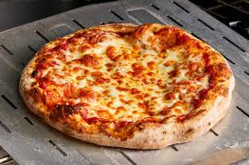
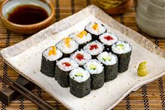
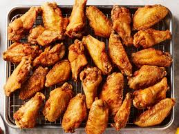

# 🍔 Food Image Classification using ResNet

## 📌 Overview

This project builds a deep learning model to classify food images into 101 categories using the Food-101 dataset.

A pretrained ResNet model is fine-tuned using transfer learning to recognize different types of food from images.

---

## 🎯 Project Goal

The goal is to develop a model that can:

* Take an input food image
* Predict its category (e.g., pizza, sushi, ramen)
* Generalize well to unseen images

---

## 🧠 Model Architecture

* Model: ResNet (Transfer Learning)
* Backbone: Pretrained on ImageNet
* Final Layer: Modified for 101 food classes

---

## 📊 Dataset

* Dataset: Food-101
* Classes: 101 food categories
* Training Images: 75,750
* Test Images: 25,250

---

## ⚙️ Training Details

* Framework: PyTorch
* Loss Function: CrossEntropyLoss
* Optimizer: Adam
* Epochs: 3 (baseline)
* Batch Size: 32

---

## 📈 Results

* Test Accuracy: **~54%**

The model demonstrates solid baseline performance using transfer learning.

---

## 📸 Sample Predictions

Below are example predictions from the model:

### 🍕 Example 1

**Input Image:**


**Prediction:** Pizza ✅

---

### 🍣 Example 2

**Input Image:**


**Prediction:** Sushi ✅

---

### 🍗 Example 3

**Input Image:**


**Prediction:** Chicken Wings ✅

---

## 🚀 Future Vision: Smart Food Recognition System

The long-term goal of this project is to evolve into a real-world application that can:

* 📷 Take a photo of a meal using a phone or camera
* 🍽️ Identify the food category using deep learning
* 🔥 Estimate calorie content
* 🥗 Provide nutritional information (protein, carbs, fats)

This would combine:

* Computer Vision (image classification)
* Nutrition databases
* Real-time inference systems

Potential applications include:

* Personal diet tracking
* Fitness and health apps
* Smart restaurant recommendations

---

## 🚀 How to Run

### 1. Clone the repository

```bash
git clone https://github.com/PowerRanger18/food-image-recognition.git
cd food-image-recognition
```

### 2. Open in Google Colab

Open:

```
food_image_cnn.ipynb
```

### 3. Run all cells

* Train the model
* Evaluate performance
* Test predictions on custom images

---

## 🔧 Future Improvements

* Increase training epochs (5–10+)
* Fine-tune deeper layers of ResNet
* Add data augmentation
* Improve accuracy to 70%+
* Build a web app using Gradio or Flask
* Integrate nutrition/calorie estimation system

---

## 📚 Key Concepts

* Transfer Learning
* Convolutional Neural Networks (CNNs)
* Image Classification
* Model Evaluation

---

## 👤 Author

GitHub: https://github.com/PowerRanger18

---

## ⭐ Acknowledgements

* PyTorch & Torchvision
* Food-101 dataset creators
* ImageNet pretrained models

